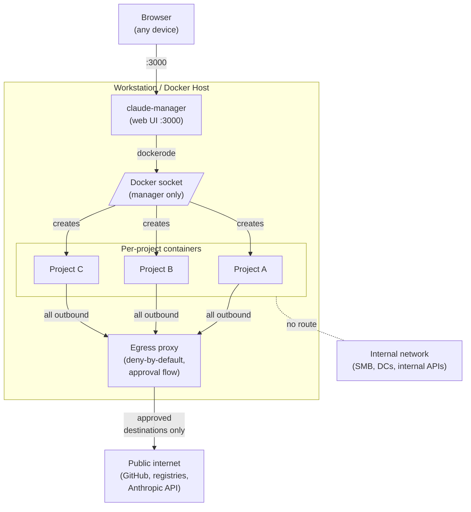

I'm a security consultant. I run AI agents every day — to analyse assessment data, write triage scripts, draft reports. They're genuinely useful. They're also a new kind of endpoint: one that can read files, execute code, install tools, and reach the network, all without a human clicking "approve" for every step.

Most AI coding agents run on your workstation with your user account. That means they can see every repo, every mounted share, every cached credential, and every internal host your user can reach. If you're switching between customer engagements, they see all of it at once. If a skill or MCP server turns out to be malicious, it runs with your permissions against your network.

I treat my admin workstation with segmentation, least privilege, and a clear blast radius. I wanted the same for my agents. So I built it.

## Threat model

Before the architecture, the threats I'm actually trying to contain:

- **Autonomous code execution.** The agent writes and runs code by design. A bug, a bad prompt, or a prompt-injected input can turn "help me clean up this folder" into something destructive. I want that contained.
- **Prompt injection via untrusted input.** I feed the agent log files, HTML pages, scan output, customer documents. Any of those can carry instructions aimed at the model. I assume the model will eventually be tricked.
- **Supply chain.** MCP servers, skills, and npm packages an agent can install on its own. This is `npm install` with even less human review. One compromised component and attacker code is running inside the agent.
- **Credential exposure.** Tokens stored in config files, SSH keys on disk, cached Azure/AWS creds in the user profile. If the agent can read them, so can anything that subverts the agent.
- **Cross-engagement data bleed.** Customer A's data must not end up in Customer B's context. Ever.
- **Lateral movement.** My workstation can reach internal resources. An agent running as me can too. I don't want that.

The goal isn't to stop the agent from being wrong. It's to make "the agent was wrong" a survivable event.

## The architecture

A management container ([claude-manager](https://github.com/FrederikLeed/claude-manager)) runs the web UI and creates sibling containers via the Docker socket. Each project gets its own container, its own workspace volume, its own agent memory. The Docker socket is mounted **only** into the manager — never into project containers.

Everything below is about what that actually buys you in practice.

## Container per project: segmentation and blast radius

Each customer, each project, each risky experiment gets its own container. Same principle I apply to admin workstations: one task, one scope, one context.

What that gets me:

- **Blast radius.** If the agent deletes files, installs something weird, or gets talked into running hostile code, the damage stops at that container's workspace volume. The host, my other projects, and my other agents are untouched. Worst case is `docker rm` and recreate.
- **Segmentation.** Customer A's assessment data physically cannot end up in Customer B's context. Not "we tell the agent not to" — the files literally aren't on the filesystem it can see.
- **Clean recovery.** A compromised container is cattle, not a pet. Kill it, recreate from image, re-clone the repo, done.

## Limited host access: what the agent can and cannot see

The interesting surface isn't the network — it's the filesystem. An agent running as your user sees your home directory, your SSH keys, your `.aws/credentials`, your browser profile. An agent in a container sees only what you explicitly mount.

In my setup, each project container has a short, explicit mount list:

| Mount                         | Purpose                      | Scope                |
|-------------------------------|------------------------------|----------------------|
| `/workspace` (named volume)   | The project's code           | This container only  |
| `/workspace/.claude`          | Per-project agent memory     | This container only  |
| `/shared`                     | File exchange with host/agents | Shared, intentional |
| `/home/claude/.claude`        | Agent config + OAuth session | Shared, auth only    |

Not mounted: my user profile, my SSH keys, my cloud credential caches, my PowerShell history, my Outlook cache, my Documents folder, anything from `C:\Users\...`. None of it exists from the agent's perspective.

The Docker socket is mounted into the manager only. Project containers don't get it by default. If a specific agent needs it — say, one that manages other containers — it's an opt-in flag on that instance, not the default. The same thinking as any privileged mount: off unless you consciously decide otherwise.

## Network boundaries: deny-by-default with an approval flow

Project containers attach to an isolated bridge network with no route to my internal network, no access to SMB shares, no access to internal DNS. That part is the easy half.

The harder half is egress to the public internet. "The agent can reach the internet" is how data exfiltrates after a prompt injection, and it's also how the agent does its job (`gh`, `npm`, the Anthropic API, cloning repos). I didn't want to choose.

So all outbound traffic from project containers is forced through a proxy, and the proxy is deny-by-default. Known destinations the agent needs for normal work — the Anthropic API, GitHub, the package registries it's already using — are pre-approved. Anything new triggers an approval prompt: the proxy holds the request, I get a notification, I approve or deny, the request continues or fails.

From the container's point of view:

- Pre-approved destinations are transparent. Git works, npm works, the API works.
- A new destination — a random URL the agent was told to `curl`, an MCP server pulling from an unexpected host — blocks until I say yes.
- Container-to-container traffic is off. Project A can't reach Project B.

This doesn't stop the agent from misbehaving on an allowed channel (a git push to a repo I've already approved is still a git push). But it makes the common exfiltration patterns — "the model was told to send my data to `attacker.example`" — a decision I'm aware of, not a silent request leaving the network.

## Credentials: OAuth device flow, no stored tokens

The agent authenticates to GitHub and to Claude via device flow. I approve the device from my own browser; the container never sees a PAT or an API key in a config file. The session lives in the mounted auth directory, scoped to the agent, and can be revoked from the provider side at any time.

No `.env` with secrets. No `GH_TOKEN` in the shell profile. No `ANTHROPIC_API_KEY` baked into the image. If the container is compromised, there's no long-lived credential on disk to lift.

## What this does not solve

Isolation handles blast radius and lateral movement. It doesn't handle everything.

### Supply chain

The MCP server and skill ecosystem is a supply chain problem waiting to be exercised. Autonomously installable third-party code with minimal review — that's the pattern, not the exception. Container isolation limits what a compromised skill can reach, and the egress proxy stops it phoning home to a host I haven't approved. But it doesn't stop the agent from doing what it's told inside the container.

My current rule is boring and manual: I don't let agents install MCP servers or skills on their own. If I want one, I add it deliberately, read the source, and rebuild the image.

### Data residency

I use Claude to analyse customer assessment data because the analysis is significantly better than what I'd produce in the same time. But the compliance question is real: where does that data go, how long is it kept, is it used for training. Container isolation doesn't answer any of that.

My current position is: customer consent is required before their data touches any hosted AI. Where I want to end up is local model processing — on-premises, data never leaves my network. The hardware isn't there yet for me, but that's the direction.

### The model itself

If the model is prompt-injected and decides to exfiltrate via an already-approved channel (a git push to a repo I've allowed, a call to the Anthropic API), isolation doesn't stop that. The egress proxy narrows the set of channels; it doesn't eliminate them. `claude-manager`'s activity log at least captures what the agent did, so prompt-injection attempts leave a trail — but detecting them in the trail is a problem I haven't solved.

## More in a follow-up post

This post is the security layer. The same setup also handles a few things that aren't about containment but about day-to-day usability:

- Persistent per-project memory across sessions.
- Shared tmux terminals accessible from any device (laptop, workstation, phone).
- A fleet view for managing multiple running agents.
- File exchange between host and agents (and between agents) via `/shared`.

I'll write those up separately. They're interesting in their own right, but they're not what this post is about.

## What's next

- **Local model inference** for customer data, so nothing sensitive leaves the network.
- **Better detection** on the activity log — turning the audit trail into alerts for prompt-injection patterns, not just a record after the fact.
- **Tighter in-container sandboxing** (seccomp, Landlock) beyond the current Docker defaults.

The setup isn't finished and it isn't the right answer for everyone. But it moves AI agents from "runs on my workstation with my permissions" to "runs in a box I chose the edges of" — and that's the bar I wanted to hit before putting them near customer data.

Code is public if you want to look at how it's wired:

- [claude-manager](https://github.com/FrederikLeed/claude-manager) — management UI and workspace image source.
